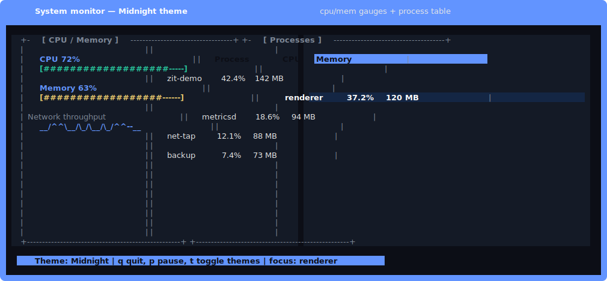
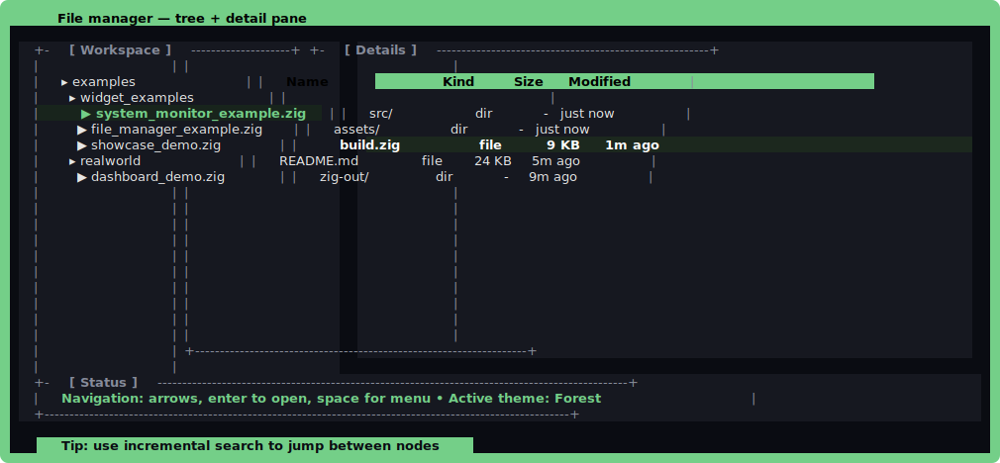
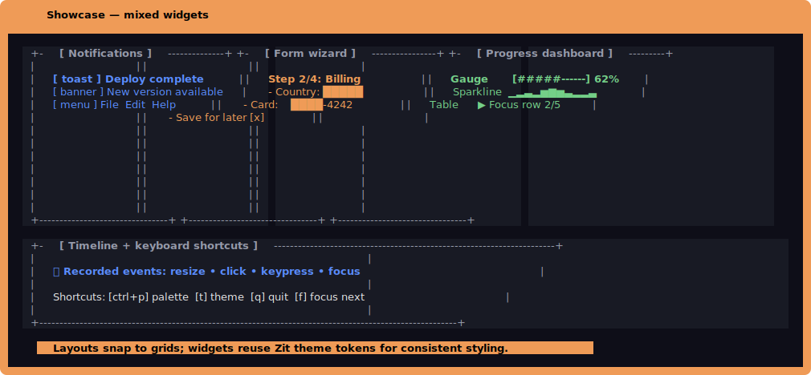

# Zit - A Text User Interface Library for Zig

Zit is a TUI (Text User Interface) library for Zig that enables developers to create interactive terminal applications. The library provides tools for terminal manipulation, input handling, rendering, layout management, and widget creation.

## Features

- **Terminal handling**: Cross-platform terminal operations with raw mode support
- **Text rendering**: Support for colors (named colors), styles (bold, italic, underline), and basic text drawing
- **Layout system**: Basic layout management with Rect-based positioning, flex/grid containers, and constraint anchoring
- **Widget library**: Core UI components including:
  - Labels
  - Buttons
  - Checkboxes
  - Progress bars
  - Toggles, radio groups, sliders, rating stars, status bars, toolbars, breadcrumbs, pagination, accordions, wizards/steppers, command palette, notification center
  - Color picker/palettes
  - Lists
  - Popups, toasts, menu bars, and canvas primitives
- **Input handling**: Keyboard and mouse event processing
- **Typeahead navigation**: Incremental, case-insensitive jumping for lists, tables, and the file browser with configurable timeouts
- **Event system**: Basic event handling for widgets
- **Animations**: Reusable animator with easing and yoyo/repeat
- **Accessibility**: Annotate widgets with roles and focus announcements
- **Async utilities**: Timer manager plus async application loop helpers
- **Modern and intuitive API**
- **Efficient memory management**
- **Thread-safe components**
- **Rich widget set**
- **Cross-platform support**
- **Zero dependencies**

## Quick start (5 lines)

```zig
const zit = @import("zit");

pub fn main() !void {
    try zit.quickstart.renderText("Hello, Zit!", .{});
}
```

Need a widget fast? Fluent builders make configuration readable and type-safe:

```zig
const button = try zit.widget.ButtonBuilder.init(allocator)
    .text("Deploy")
    .borderStyle(.double)
    .onPress(myHandler)
    .build();
```

## Why Zit over other TUIs?

| Capability | Zit | Typical terminal UI libs |
| --- | --- | --- |
| Widgets | 36+ built-ins (gauges, steppers, charts, typeahead lists/tables, palettes, menus) | Often 5-15 primitives; complex widgets assembled manually |
| Navigation aids | Typeahead on lists/tables/file browser, focus rings, wizard stepper | Usually manual filtering or custom key handlers |
| Theming | Light/dark/high-contrast palettes + per-widget overrides | Global color constants or app-defined palettes |
| Motion & feedback | Animator with easing/yoyo, timers, toasts, notification center | Rare or needs external crates |
| Pointer UX | Mouse + drag-and-drop with payloads, context menus anywhere | Frequently keyboard-only |
| Accessibility | Focus announcements and annotated roles built in | Typically omitted or ad-hoc |

## Common patterns

Split panes and quick theming:

```zig
var pane = try zit.widget.SplitPane.init(allocator);
pane.setOrientation(.horizontal);
pane.setRatio(0.35);
pane.setFirst(&tree.widget);
pane.setSecond(&table.widget);

const palette = zit.widget.theme.Theme.highContrast();
tree.setTheme(palette);
table.header_bg = palette.color(.accent);
table.header_fg = palette.color(.background);
try pane.widget.layout(zit.layout.Rect.init(1, 1, width - 2, height - 2));
try pane.widget.draw(&renderer);
```

Table/list typeahead (works out of the box; just set timeouts to taste):

```zig
var services = try zit.widget.Table.init(allocator);
defer services.deinit();
try services.addColumn("Service", 20, true);
try services.addColumn("Owner", 12, true);
try services.addRow(&.{ "gateway", "alice" });
try services.addRow(&.{ "search", "carmen" });
services.setTypeaheadTimeout(700); // milliseconds
services.widget.focused = true;    // type to jump
```

Context menus anywhere you can point or right-click:

```zig
var ctx = try zit.widget.ContextMenu.init(allocator);
defer ctx.deinit();
try ctx.addItem("Copy", true, null);
try ctx.addItem("Delete", false, null);
ctx.setOnSelect(struct {
    fn choose(_: usize, item: zit.widget.ContextMenuItem, _: ?*anyopaque) void {
        std.debug.print("picked: {s}\n", .{item.label});
    }
}.choose, null);

// Open beside the cursor (e.g. on right-click)
ctx.openAt(mouse_x, mouse_y);
if (ctx.open) try ctx.widget.draw(&renderer);
```

## Memory Management

Zit provides a sophisticated memory management system designed for optimal performance and safety in TUI applications. The system includes:

### MemoryManager

The core memory management component that coordinates different allocators:

```zig
var memory_manager = try memory.MemoryManager.init(allocator, arena_size, widget_pool_size);
defer memory_manager.deinit();

// Get the arena allocator for temporary allocations
const arena = memory_manager.getArenaAllocator();

// Get the widget pool allocator for widget instances
const widget_pool = memory_manager.getWidgetPoolAllocator();
```

### ArenaAllocator

A fast allocator for temporary allocations with automatic cleanup:

```zig
var arena = try memory.ArenaAllocator.init(parent_allocator, size, is_thread_safe);
defer arena.deinit();

// Reset the arena to free all allocations
arena.reset();
```

### PoolAllocator

An efficient allocator for widget instances with object reuse:

```zig
var pool = try memory.PoolAllocator.init(parent_allocator, node_size, initial_capacity);
defer pool.deinit();

// Get statistics about pool usage
const stats = pool.getStats();
```

### Memory Safety

Built-in safety features to prevent common memory issues:

```zig
var safety = try memory.MemorySafety.init(allocator);
defer safety.deinit();

// Validate pointer access
if (safety.validatePointer(ptr, len)) {
    // Safe to use the pointer
}

// Check for buffer overflows
try safety.checkAllocations();
```

### Memory Debugging

Tools for tracking memory usage and detecting leaks:

```zig
var debugger = try memory.MemoryDebugger.init(allocator);
defer debugger.deinit();

// Track allocations
const ptr = try debugger.allocator().alloc(u8, 100);
defer debugger.allocator().free(ptr);

// Dump memory leaks
try debugger.dumpLeaks(std.io.getStdErr().writer());
```

### Memory Optimization

Performance optimizations for memory-intensive operations:

```zig
var optimizer = try memory.MemoryOptimizer.init(allocator);
defer optimizer.deinit();

// Pre-allocate cache lines
optimizer.optimize(256);

// Get optimization statistics
const stats = optimizer.getStats();
```

## Usage Example

```zig
const std = @import("std");
const zit = @import("zit");
const memory = zit.memory;

pub fn main() !void {
    // Initialize memory manager
    var gpa = std.heap.GeneralPurposeAllocator(.{}){};
    defer _ = gpa.deinit();
    const allocator = gpa.allocator();

var memory_manager = try memory.MemoryManager.init(allocator, 1024 * 1024, 100);
defer memory_manager.deinit();

// Initialize terminal with memory manager
var term = try zit.terminal.init(memory_manager.getArenaAllocator());
    defer term.deinit() catch {};

    // Create widgets using the widget pool allocator
    var button = try zit.widget.Button.init(memory_manager.getWidgetPoolAllocator(), "Click Me!");
    defer button.deinit();

// ... rest of the application code
}
```

## Animations and timers

Zit ships with a lightweight animation driver (with easing and yoyo/repeat) plus a timer manager that plugs into the application loop:

```zig
var app = zit.event.Application.init(allocator);
try app.enableAccessibility(); // optional: wire focus announcements

// Animate a progress value for 250ms
var gauge = try zit.widget.Gauge.init(allocator);
_ = try app.addAnimation(.{
    .duration_ms = 250,
    .on_update = struct {
        fn update(progress: f32, ctx: ?*anyopaque) void {
            const gauge = @as(*zit.widget.Gauge, @ptrCast(@alignCast(ctx.?)));
            gauge.setValue(progress * 100);
        }
    }.update,
    .context = @ptrCast(gauge),
});

// Fire a repeating task every second
_ = try app.scheduleTimer(1000, 1000, struct {
    fn tick(_: ?*anyopaque) void {
        std.debug.print(\"tick\\n\", .{});
    }
}.tick, null);
```

## Accessibility

Mark widgets with accessible roles and names so focus changes can be announced:

```zig
try app.enableAccessibility();
try app.registerAccessibleNode(.{
    .widget_ptr = &button.widget,
    .role = zit.widget.AccessibilityRole.button,
    .name = \"Submit\",
    .description = \"Send the form\",
});
```

## Examples and benchmarks

- Widget demos in `examples/widget_examples/`:
  - `zig build notifications-example` – popups, toasts, menu bar, canvas, drag-and-drop payloads.
  - `zig build dashboard-example` – tree + sparkline + gauge with theme toggles.
  - `zig build table-example` – typeahead navigation on tables.
  - `zig build file-browser-example` – explore folders with incremental search.
  - `zig build file-manager-example` – tree + list + context menu mini file manager.
  - `zig build form-wizard-example` – multi-step form with validation and toggles.
  - `zig build system-monitor-example` – gauges, sparkline, live process table.
- Realistic screens: `zig build htop-clone`, `zig build file-manager`, `zig build text-editor`, `zig build dashboard-demo`.
- Rendering benchmark: `zig build bench` runs `examples/benchmarks/render_bench.zig` to gauge draw throughput.

### Demo previews





To refresh these assets with real terminal frames, run `python scripts/make_screenshots.py` (requires a PTY/terminal). For a recorder-free refresh that works in sandboxed environments, use the built-in mock layouts with `python scripts/make_screenshots.py --mock`.

## Best Practices

1. Use the `MemoryManager` as the primary interface for memory management
2. Use the arena allocator for temporary allocations that can be freed together
3. Use the widget pool allocator for widget instances
4. Enable memory safety checks in development builds
5. Use the memory debugger to track down leaks
6. Consider using the memory optimizer for performance-critical sections

## Thread Safety

All memory management components are thread-safe by default. The `ArenaAllocator` can be configured for thread safety:

```zig
// Create a thread-safe arena
var arena = try memory.ArenaAllocator.init(allocator, size, true);
```

## Performance Considerations

- The arena allocator is extremely fast for temporary allocations
- The pool allocator reduces fragmentation for widget instances
- The memory optimizer can significantly improve performance for repeated allocations
- Memory safety checks have minimal overhead in release builds

## Installation

Add Zit to your project:

```bash
# Clone the repository
git clone https://github.com/oswalpalash/zit.git

# Add as a dependency in your build.zig
```

In your `build.zig`:

```zig
const zit_dep = b.dependency("zit", .{
    .target = target,
    .optimize = optimize,
});

const zit_module = zit_dep.module("zit");
exe.addModule("zit", zit_module);
```

## Quick Start

Here's a simple example to get you started:

```zig
const std = @import("std");
const zit = @import("zit");

pub fn main() !void {
    // Initialize allocator
    var gpa = std.heap.GeneralPurposeAllocator(.{}){};
    defer _ = gpa.deinit();
    const allocator = gpa.allocator();

    // Initialize terminal
    var term = try zit.terminal.init(allocator);
    defer term.deinit() catch {};

    // Get terminal size
    const width = term.width;
    const height = term.height;

    // Initialize renderer
    var renderer = try zit.render.Renderer.init(allocator, width, height);
    defer renderer.deinit();

    // Enable raw mode
    try term.enableRawMode();
    defer term.disableRawMode() catch {};

    // Initialize input handler
    var input_handler = zit.input.InputHandler.init(allocator, &term);
    try input_handler.enableMouse();

    // Create a label
    var label = try zit.widget.Label.init(allocator, "Hello, Zit!");
    defer label.deinit();
    label.setAlignment(.center);
    label.setColor(
        zit.render.Color{ .named_color = zit.render.NamedColor.bright_white },
        zit.render.Color{ .named_color = zit.render.NamedColor.blue }
    );

    // Main event loop
    var running = true;
    while (running) {
        // Clear the buffer
        renderer.back.clear();
        
        // Draw the label
        const label_rect = zit.layout.Rect.init(
            if (width > 20) (width - 20) / 2 else 0,
            if (height > 1) height / 2 else 0,
            20,
            1
        );
        try label.widget.layout(label_rect);
        try label.widget.draw(&renderer);
        
        // Render to screen
        try renderer.render();
        
        // Poll for events with a 100ms timeout
        const event = try input_handler.pollEvent(100);
        
        if (event) |e| {
            switch (e) {
                .key => |key| {
                    // Exit on 'q' key
                    if (key.key == 'q' and !key.modifiers.ctrl and !key.modifiers.alt) {
                        running = false;
                    }
                },
                .resize => |resize| {
                    // Resize renderer
                    try renderer.resize(resize.width, resize.height);
                },
                else => {},
            }
        }
    }
    
    // Clean up
    try term.clear();
    try term.moveCursor(0, 0);
}
```

## Core Components

### Terminal Handling

The terminal module provides basic terminal operations:

```zig
// Initialize terminal
var term = try zit.terminal.init(allocator);

// Enable raw mode for direct input
try term.enableRawMode();

// Get terminal dimensions
const width = term.width;
const height = term.height;

// Move cursor and clear screen
try term.moveCursor(x, y);
try term.clear();
```

### Input Handling

The input module processes keyboard and mouse events:

```zig
// Initialize input handler
var input_handler = zit.input.InputHandler.init(allocator, &term);
try input_handler.enableMouse();

// Poll for events with timeout
const event = try input_handler.pollEvent(100);

// Handle different event types
if (event) |e| {
    switch (e) {
        .key => |key| {
            // Handle key press
            if (key.key == 'q' and !key.modifiers.ctrl and !key.modifiers.alt) {
                // Exit on 'q'
            }
        },
        .mouse => |mouse| {
            // Handle mouse event
        },
        .resize => |resize| {
            // Handle terminal resize
        },
        else => {},
    }
}
```

### Typeahead navigation

List, Table, and FileBrowser widgets accumulate printable keystrokes while focused to jump to the next matching row or entry. The buffer clears on Escape or after `search_timeout_ms` (900ms by default):

```zig
list.setTypeaheadTimeout(1_200);
table.setTypeaheadTimeout(800);
browser.resetTypeahead(); // helpful after directory changes
```

### Rendering

The render module manages screen drawing:

```zig
// Initialize renderer
var renderer = try zit.render.Renderer.init(allocator, width, height);

// Clear the back buffer
renderer.back.clear();

// Draw text with color and style
renderer.drawStr(
    x, y, "Hello, World!",
    zit.render.Color{ .named_color = zit.render.NamedColor.bright_white },
    zit.render.Color{ .named_color = zit.render.NamedColor.blue },
    zit.render.Style.init(true, false, false) // bold
);

// Draw a box
renderer.drawBox(
    x, y, width, height,
    zit.render.BorderStyle.single,
    zit.render.Color{ .named_color = zit.render.NamedColor.white },
    zit.render.Color{ .named_color = zit.render.NamedColor.default },
    zit.render.Style{}
);

// Render to screen
try renderer.render();
```

### Widgets

The widget module provides basic UI components:

```zig
// Create a label
var label = try zit.widget.Label.init(allocator, "Hello, Zit!");
label.setAlignment(.center);
label.setColor(fg_color, bg_color);

// Create a button
var button = try zit.widget.Button.init(allocator, "Click Me!");
button.setColors(normal_fg, normal_bg, hover_fg, hover_bg);
button.setBorder(.rounded);
button.setOnPress(onButtonPress);

// Create a checkbox
var checkbox = try zit.widget.Checkbox.init(allocator, "Enable Feature");
checkbox.setColors(normal_fg, normal_bg, checked_fg, checked_bg);
checkbox.setOnChange(onCheckboxChange);

// Create a progress bar
var progress_bar = try zit.widget.ProgressBar.init(allocator);
progress_bar.setValue(30);
progress_bar.setShowPercentage(true);
progress_bar.setColors(fg, bg, empty_fg, empty_bg);
progress_bar.setBorder(.single);

// Create a list
var list = try zit.widget.List.init(allocator);
try list.addItem("Option 1");
try list.addItem("Option 2");
list.setSelectedIndex(0);
list.setOnSelect(onListSelect);
list.setColors(normal_fg, normal_bg, selected_fg, selected_bg);
list.setBorder(.single);

// Autocomplete text input
var autocomplete = try zit.widget.AutocompleteInput.init(allocator, 64);
try autocomplete.setSuggestions(&[_][]const u8{ "alpha", "beta", "gamma" });

// Drop-in charts (bar, line, area)
var chart = try zit.widget.Chart.init(allocator);
chart.setType(.bar);
try chart.addSeries("Throughput", &[_]f32{ 1.0, 2.0, 3.5, 4.0 }, null, null);

// Context menu opened at arbitrary coordinates
var ctx = try zit.widget.ContextMenu.init(allocator);
try ctx.addItem("Copy", true, null);
try ctx.addItem("Delete", false, null);
ctx.openAt(10, 4);
```

## Development

Configure Git to use the repo's hooks so the pre-commit `zig build` check runs locally:

```bash
git config core.hooksPath .githooks
```

## License

This project is licensed under the MIT License - see the [LICENSE](LICENSE) file for details.
