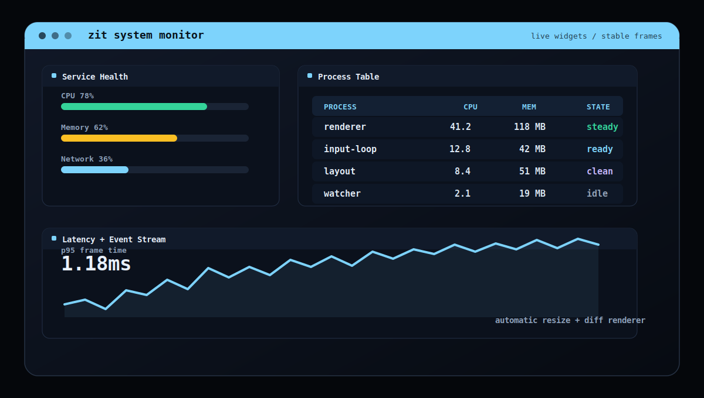
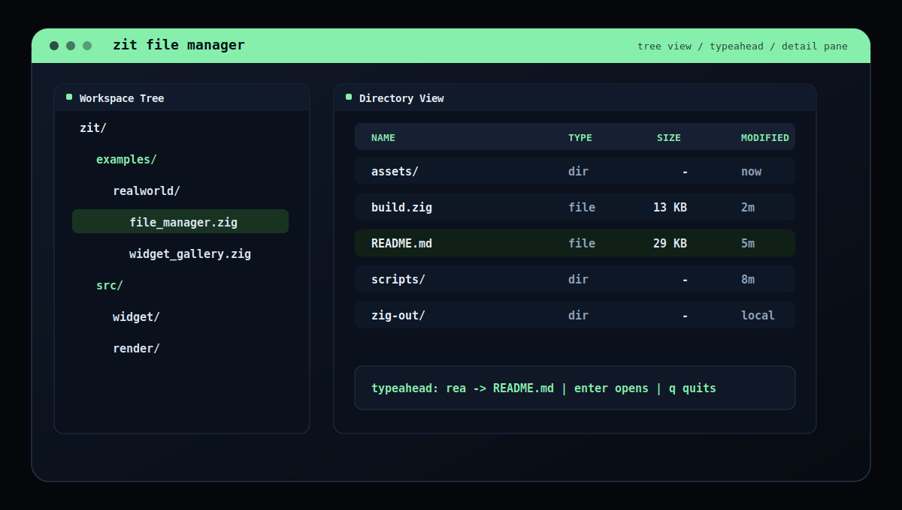
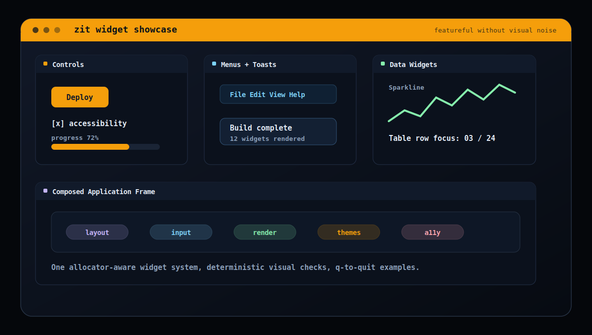

# Zit – Zig-first Terminal UI Toolkit

[](https://github.com/oswalpalash/zit/actions/workflows/build.yaml)
[](https://github.com/oswalpalash/zit/releases)
[](LICENSE)


Zit helps you ship terminal dashboards, editors, and workflows with the same confidence you expect from GUI toolkits: a rich widget catalog, focus and typeahead helpers, fast rendering, and accessibility baked in. Zero dependencies, test coverage, and benchmarks included. The project is governed by four public-facing tenets: efficiency, reliability, stability, and features, in that order.

## Why Zit
- 30+ production-ready widgets (blocks/paragraphs, charts, tables with typeahead, context menus, popups, file browser, bracketed paste-aware inputs).
- Batteries-included UX: mouse + drag-and-drop payloads, focus rings, typeahead search on lists/tables/file browser, accessibility roles/announcements.
- Automatic terminal resizing: bind an `Application` to your input handler and renderer/reflow manager once; resize events update buffers and layout from the app loop.
- Thoughtful theming and motion: light/dark/high-contrast palettes, per-widget `setTheme`, animator with easing/yoyo, timers for periodic work.
- Works the Zig way: explicit `init`/`deinit`, allocator-friendly builders, zero global state, tested layouts + render paths, rendering benchmarks.

## Screenshots

| System monitor | File manager |
| --- | --- |
|  |  |



## Feature Highlights

Compose real screens quickly:

```zig
const std = @import("std");
const zit = @import("zit");
const theme = zit.widget.theme;

const alloc = std.testing.allocator; // replace with your allocator

var tree = try zit.widget.TreeView.init(alloc);
defer tree.deinit();
_ = try tree.addRoot("services");
try tree.setTheme(theme.Theme.dark());

var gauge = try zit.widget.Gauge.init(alloc);
defer gauge.deinit();
try gauge.setTheme(theme.Theme.highContrast());
try gauge.setLabel("CPU");
gauge.setRange(0, 100);

var split = try zit.widget.SplitPane.init(alloc);
defer split.deinit();
split.setOrientation(.horizontal);
try split.setTheme(theme.Theme.dark());
split.setFirst(&tree.widget);
split.setSecond(&gauge.widget);
```

Navigate instantly with typeahead and fluent builders:

```zig
const std = @import("std");
const zit = @import("zit");
const alloc = std.testing.allocator;
var table_builder = zit.widget.TableBuilder.init(alloc);
_ = try table_builder.addColumn(.{ .header = "Service", .width = 16, .sortable = true });
_ = try table_builder.addColumn(.{ .header = "Owner", .width = 10, .sortable = true });
const table = try table_builder.build();
defer table.deinit();

try table.addRow(&.{ "gateway", "alice" });
try table.addRow(&.{ "search", "carmen" });
table.setTypeaheadTimeout(750); // printable keys jump rows while focused
table.widget.focused = true;
```

Add motion and recurring tasks without extra plumbing:

```zig
const std = @import("std");
const zit = @import("zit");
const alloc = std.testing.allocator;
var app = zit.event.Application.init(alloc);
var spark = try zit.widget.Sparkline.init(alloc);
defer spark.deinit();

_ = try app.addAnimation(.{
    .duration_ms = 200,
    .on_update = struct {
        fn update(progress: f32, ctx: ?*anyopaque) void {
            const widget = @as(*zit.widget.Sparkline, @ptrCast(@alignCast(ctx.?)));
            const value: f32 = 20 + progress * 80;
            widget.push(value) catch {};
        }
    }.update,
    .context = @ptrCast(spark),
});

_ = try app.scheduleTimer(1000, 1000, struct {
    fn tick(ctx: ?*anyopaque) void {
        const widget = @as(*zit.widget.Sparkline, @ptrCast(@alignCast(ctx.?)));
        widget.push(42) catch {};
    }
}.tick, spark);
```
`tickOnce()`/`pollUntil()` keep event processing non-blocking when you embed Zit in another loop, and `startBackgroundTask()` emits a completion event once background work finishes (or is cancelled) without stalling the UI thread.

## Internationalization
- Grapheme-aware rendering keeps emoji/CJK/combining sequences aligned and draws RTL text in visual order when needed.
- Flex rows understand RTL flow via `layout.FlexLayout.layoutDirection(.rtl)`, and `Renderer.setTextDirection()` flips string ordering per-call.
- `zit.i18n` ships message catalogs, plural helpers, and lightweight date/number formatting to externalize user-facing strings.

## Comparison

| Capability            | Zit | Other Zig TUIs |
| ---                   | --- | --- |
| Widgets               | 30+ ready widgets (gauges, charts, typeahead tables, context menus, popups, drag targets) | Usually 5–15 primitives that require manual composition |
| Input UX              | Keyboard + mouse, drag payloads, focus rings, typeahead on lists/tables/file browser, bracketed paste | Often keyboard-only; advanced behaviors are app code |
| Theming               | Light/dark/high-contrast palettes, per-widget `setTheme`, role-based colors | Basic color constants or app-defined palettes |
| Motion/Feedback       | Animator with easing/yoyo, timers, toasts/notifications | Rarely built-in |
| Accessibility         | Roles + focus announcements wired through `Application` | Typically absent |
| Documentation         | API + widget guides, examples, benchmarks, screenshots | Minimal or example-only |

## Installation

### Zig package manager (recommended)
Requires Zig 0.16.x with package manager enabled.

1) Add Zit to `build.zig.zon` (auto-add via fetch):
```bash
zig fetch --save git+https://github.com/oswalpalash/zit
```

2) Import the module in your `build.zig`:
```zig
const zit_dep = b.dependency("zit", .{});
const zit_mod = zit_dep.module("zit");
exe.root_module.addImport("zit", zit_mod);
```

3) Keep your module list in sync with tags: the CI release job publishes GitHub releases for every `v*` tag so you can pin clean versions.

### Vendoring (offline/locked)

1) Add Zit to your tree (example: `deps/zit`):
```bash
git submodule add https://github.com/oswalpalash/zit.git deps/zit
```

2) Wire the module in `build.zig`:
```zig
const zit_module = b.createModule(.{
    .root_source_file = b.path("deps/zit/src/main.zig"),
});
exe.root_module.addImport("zit", zit_module);
```

From this repo you can also run `zig build hello-world` to launch the smallest interactive example. Interactive examples require a real terminal for raw-mode input; under non-TTY automation they exit cleanly with a short message instead of a stack trace.

## Quick Start (copy-pasteable)

```zig
const std = @import("std");
const zit = @import("zit");

pub fn main() !void {
    var gpa = std.heap.DebugAllocator(.{}){};
    defer std.debug.assert(gpa.deinit() == .ok);
    const allocator = gpa.allocator();

    var term = try zit.terminal.init(allocator);
    defer term.deinit() catch |err| zit.terminal.reportCleanupError("term.deinit", err);
    var renderer = try zit.render.Renderer.init(allocator, term.width, term.height);
    defer renderer.deinit();
    var input = zit.input.InputHandler.init(allocator, &term);
    var app = zit.event.Application.init(allocator);
    defer app.deinit();
    app.bindInput(&input);
    app.bindResize(&renderer, null);

    try term.enableRawMode();
    defer term.disableRawMode() catch |err| zit.terminal.reportCleanupError("term.disableRawMode", err);
    try term.hideCursor();
    defer term.showCursor() catch |err| zit.terminal.reportCleanupError("term.showCursor", err);

    var para = try zit.widget.Paragraph.init(allocator, "Hello from Zit! Press q to quit.");
    defer para.deinit();

    var running = true;
    while (running) {
        if (try app.pollInputOnce()) |event| switch (event) {
            .key => |key| if (key.key == 'q') running = false,
            else => {},
        };

        renderer.back.clear();
        try para.widget.layout(zit.layout.Rect.init(0, 0, renderer.back.width, renderer.back.height));
        try para.widget.draw(&renderer);
        try renderer.render();
    }

    try term.clear();
    try term.moveCursor(0, 0);
}
```

## Examples, Docs, and Benchmarks
Run everything from the repo root. Example steps launch an interactive alternate-screen TUI when a TTY is available, render their UI, and quit on `q`; under non-TTY automation they exit cleanly with a short message instead of a stack trace. `python3 scripts/interactive_example_smoke.py` runs every interactive example inside a pseudo-terminal, waits for visible content, sends `q`, and fails on allocator or panic diagnostics. Visual regression uses explicit snapshot mode through `python3 scripts/visual_repeat_check.py`.

Quick starts
- `zig build hello-world` (`examples/hello_world.zig`): five-line alternate-screen loop with raw-mode input and a centered label.
- `zig build demo` (`examples/demo.zig`): interactive sampler with buttons, checkbox, progress bar, list navigation, and animated status updates.

System checks
- `zig build terminal-test` (`examples/terminal_test.zig`): verify terminal capabilities, resize handling, and cursor control.
- `zig build input-test` (`examples/input_test.zig`): stream key and mouse events to the screen to confirm input wiring.
- `zig build render-test` (`examples/render_test.zig`): exercise color, style, and box drawing primitives.
- `zig build layout-test` (`examples/layout_test.zig`): lay out widgets and layout primitives to validate sizing math.
- `zig build widget-test` (`examples/widget_test.zig`): composite widget smoke test that renders a basic UI frame.

Widget gallery
- `zig build button-example` (`examples/widget_examples/button_example.zig`): focused button interactions and styling tweaks.
- `zig build dashboard-example` (`examples/widget_examples/dashboard_example.zig`): compact dashboard with gauges, charts, and status blocks.
- `zig build notifications-example` (`examples/widget_examples/notifications_example.zig`): toast and notification manager behavior.
- `zig build table-example` (`examples/widget_examples/table_example.zig`): sortable/searchable table with keyboard navigation.
- `zig build file-browser-example` (`examples/widget_examples/file_browser_example.zig`): file browser widget with typeahead navigation.
- `zig build file-manager-example` (`examples/widget_examples/file_manager_example.zig`): split-pane file manager interactions.
- `zig build form-wizard-example` (`examples/widget_examples/form_wizard_example.zig`): multi-step form with validation feedback.
- `zig build system-monitor-example` (`examples/widget_examples/system_monitor_example.zig`): live metrics dashboard with charts and gauges.
- `zig build widget-showcase` (`examples/widget_examples/showcase_demo.zig`): everything-in-one widget showcase.

Real-world interactive examples
- `zig build htop-clone` (`examples/realworld/htop_clone.zig`): htop-inspired dashboard rendering, open until `q`.
- `zig build file-manager` (`examples/realworld/file_manager.zig`): file manager layout, open until `q`.
- `zig build text-editor` (`examples/realworld/text_editor.zig`): text editor frame with status bars and gutters, open until `q`.
- `zig build dashboard-demo` (`examples/realworld/dashboard_demo.zig`): compact monitoring dashboard composed of core widgets, open until `q`.
- `zig build widget-gallery` (`examples/realworld/widget_gallery.zig`): interactive gallery covering core widgets and advanced controls, open until `q`.
- `zig build widget-gallery-extended` (`examples/realworld/widget_gallery_extended.zig`): interactive gallery covering text entry, structured text, charts, menus, logs, indicators, and drawing primitives, open until `q`.
- `zig build widget-gallery-layouts` (`examples/realworld/widget_gallery_layouts.zig`): interactive gallery covering layout, navigation, overlay, date/time, image, toast, accordion, and wizard widgets, open until `q`.

Benchmarks
- `zig build render-bench` (`examples/benchmarks/render_bench.zig`): micro-benchmark for renderer throughput.
- `zig build bench` (`examples/benchmarks/bench_suite.zig`): suite covering layout, widgets, input decoding, and memory-retention costs; it fails on conservative performance-budget regressions.

Documentation starts at [docs/README.md](docs/README.md), with focused guides for [docs/API.md](docs/API.md), [docs/WIDGET_CATALOG.md](docs/WIDGET_CATALOG.md), [docs/WIDGET_GUIDE.md](docs/WIDGET_GUIDE.md), [docs/APP_LOOP_TUTORIAL.md](docs/APP_LOOP_TUTORIAL.md), [docs/ARCHITECTURE.md](docs/ARCHITECTURE.md), [docs/TERMINAL_COMPAT.md](docs/TERMINAL_COMPAT.md), [docs/INTEGRATION.md](docs/INTEGRATION.md), and [docs/STABILITY.md](docs/STABILITY.md).

## Development Notes
- Widgets follow `init`/`deinit` plus `setTheme` for themed variants and surface errors instead of panicking.
- Use `zig fmt --check src/ examples/ build.zig` and `zig build quality` locally before opening a PR.
- Full release verification is `zig build release-check`; it runs quality, formatting, docs generation/link checks, public build steps, cross-target smoke, interactive PTY smoke, resize PTY smoke requiring every public interactive example to survive rapid tiny-size stress and redraw a live `resize: WxH` marker, accessibility metadata checks, mouse coordinate-contract and hit-test coverage checks, memory cleanup checks, and visual repeat captures.
- For TUI-facing changes, run `python3 scripts/visual_repeat_check.py --count 4`; it executes real-world and gallery binaries in `--snapshot` mode and writes a contact sheet for alignment, spacing, hierarchy, clipped or overlapping text, and frame-to-frame drift.
